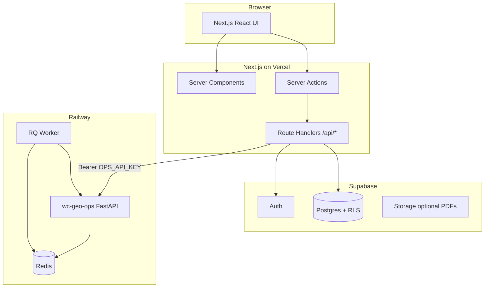

# WC GEO — Next.js + Supabase App Architecture

Build a new dashboard (no PHP). This app is the **product layer**: auth, billing, UI, and data. The **GEO engine** stays on Railway ([`wc-geo-ops-production.up.railway.app`](https://wc-geo-ops-production.up.railway.app)).

---

## System overview



| Layer | Responsibility |
|-------|----------------|
| **Next.js** | UI, session, proxy to Ops, persist audits in Supabase |
| **Supabase** | Users, audits, subscriptions, RLS |
| **wc-geo-ops** | Quick scan + full audit engine (already deployed) |

**Rule:** `OPS_API_KEY` lives only in Next.js server env (`OPS_API_KEY`), never `NEXT_PUBLIC_*`.

---

## Repo layout (recommended)

Create a **separate repo** or `web/` folder in this monorepo:

```
wc-geo-web/
├── app/
│   ├── (auth)/
│   │   ├── login/page.tsx
│   │   └── signup/page.tsx
│   ├── (dashboard)/
│   │   ├── layout.tsx
│   │   ├── page.tsx                 # Dashboard home
│   │   ├── scan/page.tsx            # New quick scan
│   │   └── audits/
│   │       ├── page.tsx             # List
│   │       └── [id]/page.tsx        # Detail + poll full job
│   ├── api/
│   │   ├── audits/
│   │   │   ├── quick/route.ts
│   │   │   ├── full/route.ts
│   │   │   └── [id]/route.ts
│   │   └── webhooks/
│   │       └── stripe/route.ts      # Phase 2
│   └── layout.tsx
├── components/
│   ├── audit-score-card.tsx
│   ├── quick-wins-list.tsx
│   ├── full-report-view.tsx
│   └── job-polling.tsx
├── lib/
│   ├── supabase/
│   │   ├── client.ts                # Browser client
│   │   ├── server.ts                # Server client (@supabase/ssr)
│   │   └── middleware.ts
│   ├── geo-ops/
│   │   └── client.ts                # Ops API wrapper
│   └── types/
│       └── audit.ts                 # From API_FRONTEND.md
├── supabase/
│   └── migrations/
│       └── 001_initial_schema.sql
├── .env.local.example
└── package.json
```

---

## Environment variables

### Next.js (`.env.local`)

```env
# Supabase
NEXT_PUBLIC_SUPABASE_URL=https://xxxx.supabase.co
NEXT_PUBLIC_SUPABASE_ANON_KEY=eyJ...

# Server only — never NEXT_PUBLIC_
SUPABASE_SERVICE_ROLE_KEY=eyJ...
OPS_API_BASE_URL=https://wc-geo-ops-production.up.railway.app
OPS_API_KEY=your-ops-key

# Phase 2 — Stripe
STRIPE_SECRET_KEY=sk_...
STRIPE_WEBHOOK_SECRET=whsec_...
NEXT_PUBLIC_STRIPE_PUBLISHABLE_KEY=pk_...
```

### Supabase dashboard

No Ops keys in Supabase. Only Postgres + Auth.

---

## Database schema

Apply [`supabase/migrations/001_initial_schema.sql`](../supabase/migrations/001_initial_schema.sql).

### Tables

| Table | Purpose |
|-------|---------|
| `profiles` | User display name, plan tier |
| `audits` | Every scan (quick + full) |
| `subscriptions` | Stripe linkage (Phase 2) |

### `audits` lifecycle

| `tier` | `status` flow | Ops call |
|--------|---------------|----------|
| `free` | `pending` → `completed` / `failed` | `POST /v1/audits/quick` (sync) |
| `paid` | `pending` → `queued` → `processing` → `completed` / `failed` | `POST /v1/audits/full` + poll `GET /v1/jobs/{id}` |

### RLS

- Users read/write **only their own** `audits` and `profiles`
- `subscriptions`: read own row; writes via service role (Stripe webhook)

---

## Ops API client (server-only)

```typescript
// lib/geo-ops/client.ts
const BASE = process.env.OPS_API_BASE_URL!;
const KEY = process.env.OPS_API_KEY!;

async function opsFetch(path: string, init?: RequestInit) {
  const res = await fetch(`${BASE}${path}`, {
    ...init,
    headers: {
      Authorization: `Bearer ${KEY}`,
      "Content-Type": "application/json",
      Accept: "application/json",
      ...init?.headers,
    },
  });
  if (!res.ok) {
    const err = await res.json().catch(() => ({}));
    throw new Error(err.detail ?? res.statusText);
  }
  return res;
}

export async function quickAudit(url: string) {
  const res = await opsFetch("/v1/audits/quick", {
    method: "POST",
    body: JSON.stringify({ url }),
  });
  return res.json();
}

export async function startFullAudit(
  url: string,
  domain: string,
  clientRef: string
) {
  const res = await opsFetch("/v1/audits/full", {
    method: "POST",
    body: JSON.stringify({ url, domain, client_ref: clientRef }),
  });
  return res.json(); // 202 + job_id
}

export async function getJob(jobId: string) {
  const res = await opsFetch(`/v1/jobs/${jobId}`);
  return res.json();
}
```

---

## Next.js API routes

### `POST /api/audits/quick` (free)

1. `createServerClient()` → require logged-in user
2. Insert `audits` row (`tier: free`, `status: pending`)
3. Call `quickAudit(url)`
4. Update row: `quick_score`, `quick_summary`, `status: completed`
5. Return audit record to client

**Timeout:** Ops may take up to 60s — set `export const maxDuration = 60` on Vercel Pro (or run quick scan from client via streaming Server Action).

### `POST /api/audits/full` (paid)

1. Auth + check subscription (`profiles.plan === 'pro'` or active `subscriptions`)
2. Insert audit (`tier: paid`, `status: queued`)
3. Call `startFullAudit(url, domain, audit.id)` — use Supabase audit UUID as `client_ref`
4. Save `ops_job_id` from response
5. Return `{ auditId, jobId, status: 'queued' }`

### `GET /api/audits/[id]`

1. Auth + RLS fetch audit
2. If `tier === paid` and status not terminal:
   - Call `getJob(ops_job_id)`
   - Map Ops status → update DB (`processing`, `completed`, `failed`, `full_report`)
3. Return audit JSON for UI

### Client polling (audit detail page)

```typescript
// Poll every 15s while status is queued | processing
useEffect(() => {
  if (!["queued", "processing"].includes(audit.status)) return;
  const id = setInterval(() => refetch(`/api/audits/${audit.id}`), 15_000);
  return () => clearInterval(id);
}, [audit.status, audit.id]);
```

Alternative: Vercel Cron `GET /api/cron/poll-jobs` every minute for background sync (better if user closes tab).

---

## Auth (Supabase)

Use **@supabase/ssr** with Next.js App Router:

| Flow | Implementation |
|------|----------------|
| Sign up / login | Email+password or OAuth (Google) |
| Session | Cookie-based via `middleware.ts` |
| Protected routes | `(dashboard)/layout.tsx` checks `getUser()` |

On signup, trigger creates `profiles` row (see migration).

---

## Pages (MVP)

| Route | Features |
|-------|----------|
| `/` | Marketing landing |
| `/login`, `/signup` | Supabase Auth UI |
| `/dashboard` | Recent audits, CTA scan |
| `/scan` | URL input → free quick scan |
| `/audits` | Table: domain, score, tier, date |
| `/audits/[id]` | Quick: breakdown + quick wins. Paid: poll + full report tabs |
| `/pricing` | Free vs Pro (Phase 2 + Stripe) |

---

## Free vs paid product rules

| Feature | Free | Pro |
|---------|------|-----|
| Quick audit | Unlimited or rate-limited (your choice) | Included |
| Full audit | Locked / upgrade CTA | `POST /v1/audits/full` |
| Report history | Last N audits | Unlimited |
| PDF export | — | Phase 3 (generate from `full_report` JSON) |

Enforce paid tier in **Next.js API routes** before calling Ops full endpoint.

---

## Stripe (Phase 2)

1. Checkout Session → `subscriptions` row via webhook
2. `customer.subscription.updated` → set `profiles.plan = 'pro'`
3. Webhook handler uses `SUPABASE_SERVICE_ROLE_KEY` to bypass RLS

---

## Implementation phases

### Phase 1 — MVP (1–2 weeks)

- [ ] `create-next-app` + Tailwind + shadcn/ui
- [ ] Supabase project + migration + Auth
- [ ] Ops proxy routes (quick + full + poll)
- [ ] Dashboard + scan + audit detail UI
- [ ] Deploy Next.js to Vercel

### Phase 2 — Monetization

- [ ] Stripe Checkout + webhooks
- [ ] Gate full audit on subscription
- [ ] Pricing page

### Phase 3 — Polish

- [ ] PDF report generation (React-PDF or external)
- [ ] Email notifications (Resend + full job complete)
- [ ] Rate limiting (Upstash or Supabase)

---

## What you already have

| Asset | Location |
|-------|----------|
| Ops API (production) | `https://wc-geo-ops-production.up.railway.app` |
| API contract | [API_FRONTEND.md](API_FRONTEND.md) |
| TypeScript types | Same doc |
| Engine repo | This repo (`wc-geo-ops`) |

---

## Quick start commands

```bash
# New app (sibling folder or separate repo)
npx create-next-app@latest wc-geo-web --typescript --tailwind --eslint --app --src-dir=false

cd wc-geo-web
npm install @supabase/supabase-js @supabase/ssr

# Copy schema
mkdir -p supabase/migrations
cp ../geo-seo-claude/supabase/migrations/001_initial_schema.sql supabase/migrations/

# Supabase CLI
supabase login
supabase link --project-ref YOUR_REF
supabase db push
```

---

## Related docs

- [API_FRONTEND.md](API_FRONTEND.md) — endpoint shapes & TypeScript types
- [GEO_OPERATIONS_BACKEND.md](../GEO_OPERATIONS_BACKEND.md) — raw Ops contract
- [RAILWAY.md](../RAILWAY.md) — engine deployment
